# Coupon Management System

A robust coupon management system built with NestJS, PostgreSQL, and Redis, designed to handle coupon creation, assignment, locking, and redemption processes.

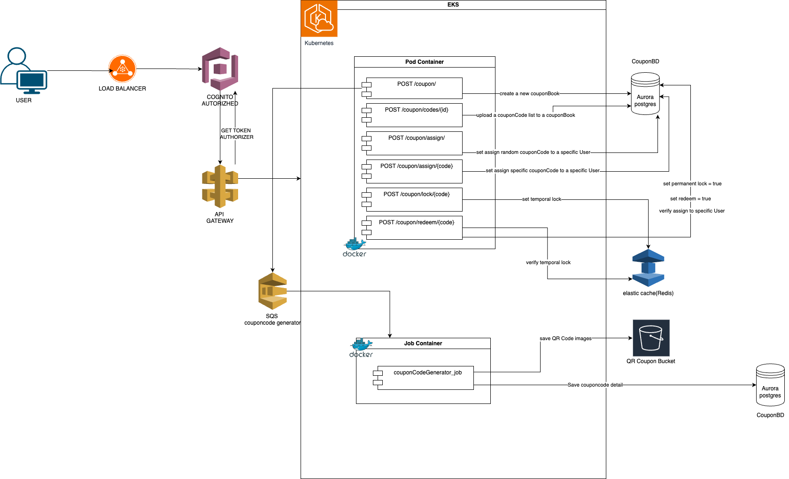

## Table of Contents
- [Features](#features)
- [Service Method Flows](#service-method-flows)
- [Postman Evidences](#postman-evidences)
- [Tech Stack](#tech-stack)
- [Prerequisites](#prerequisites)
- [Installation](#installation)
- [API Documentation](#api-documentation)
- [API Endpoints](#api-endpoints)
- [Testing](#testing)
- [AWS Deployment](#aws-deployment)
- [Project Structure](#project-structure)
- [Contributing](#contributing)
- [License](#license)
- [Support](#support)
- [Acknowledgments](#acknowledgments)


## Features

- 🎫 Create and manage coupon books
- 🔑 Generate and upload coupon codes
- 👤 Assign coupons to users
- 🔒 Lock coupons for redemption
- 💰 Redeem coupons
- 📊 Track coupon usage and statistics

## Service Method Flows
### 1. uploadCodes
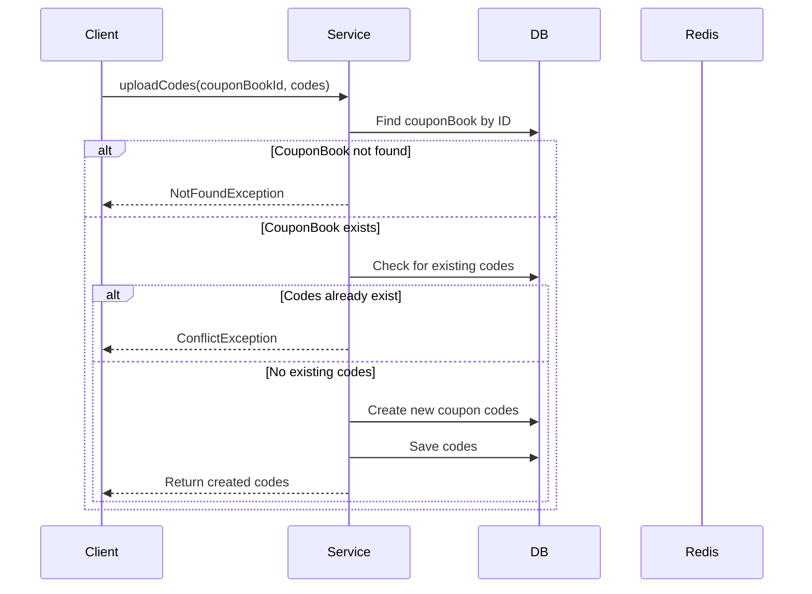

### 2. assignRandomCouponCode
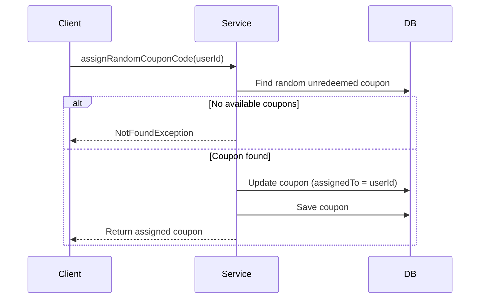

### 3. assignSpecificCouponCode
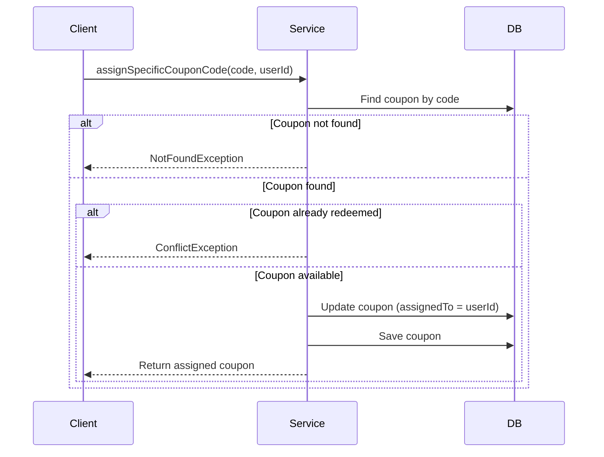

### 4. lockCouponCode
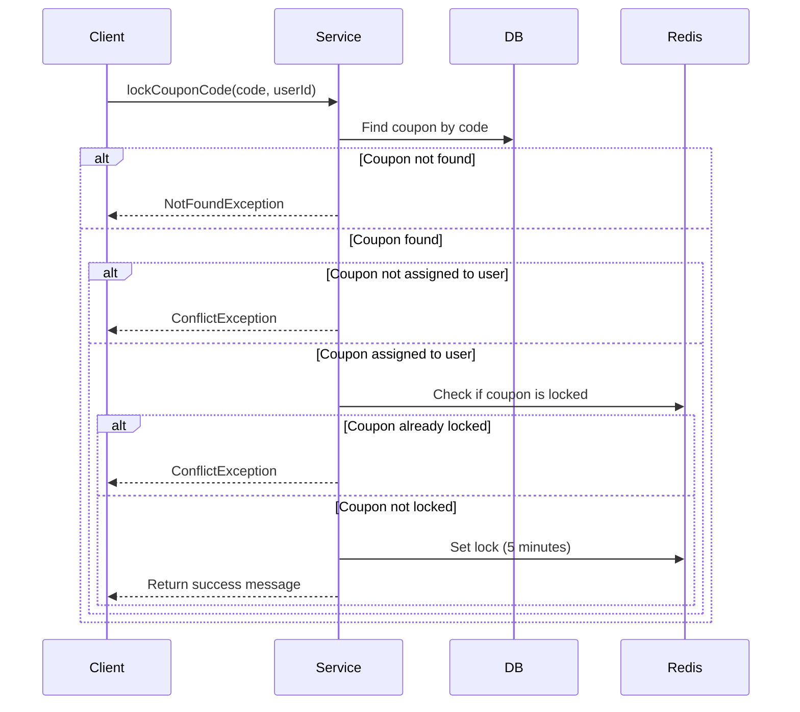

### 5. redeemCouponCode
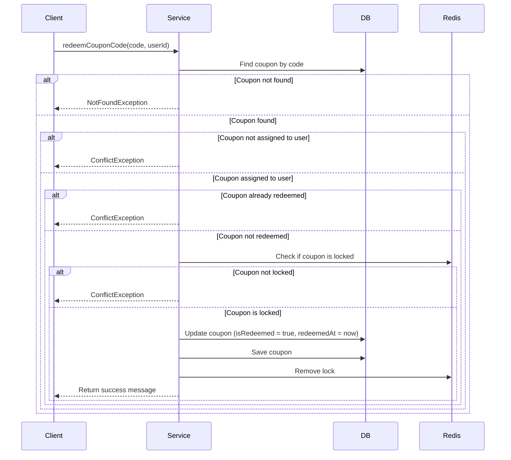
## Postman Evidences

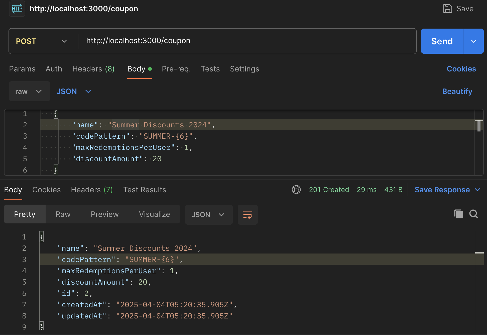
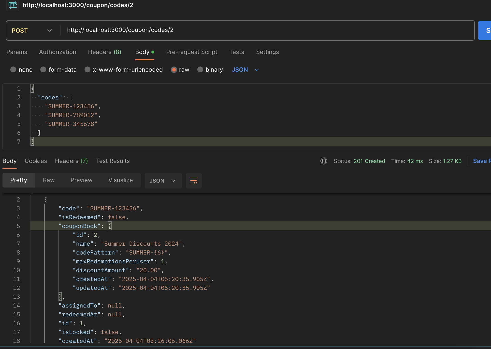
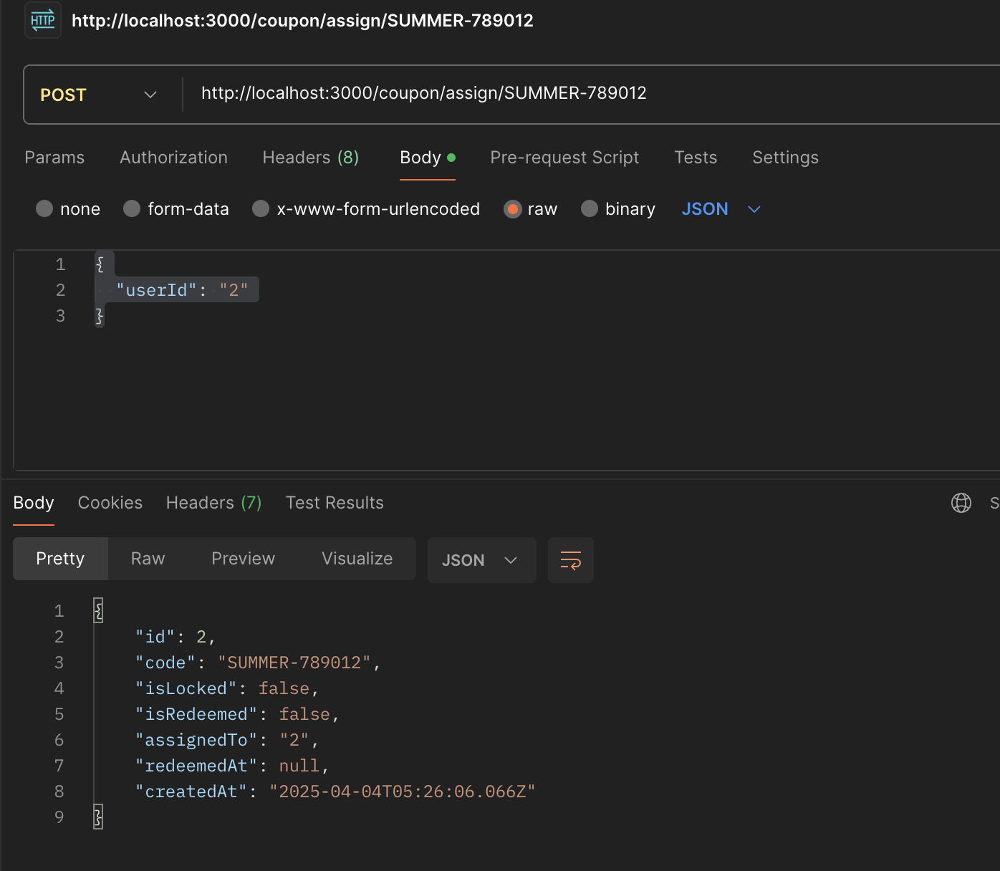
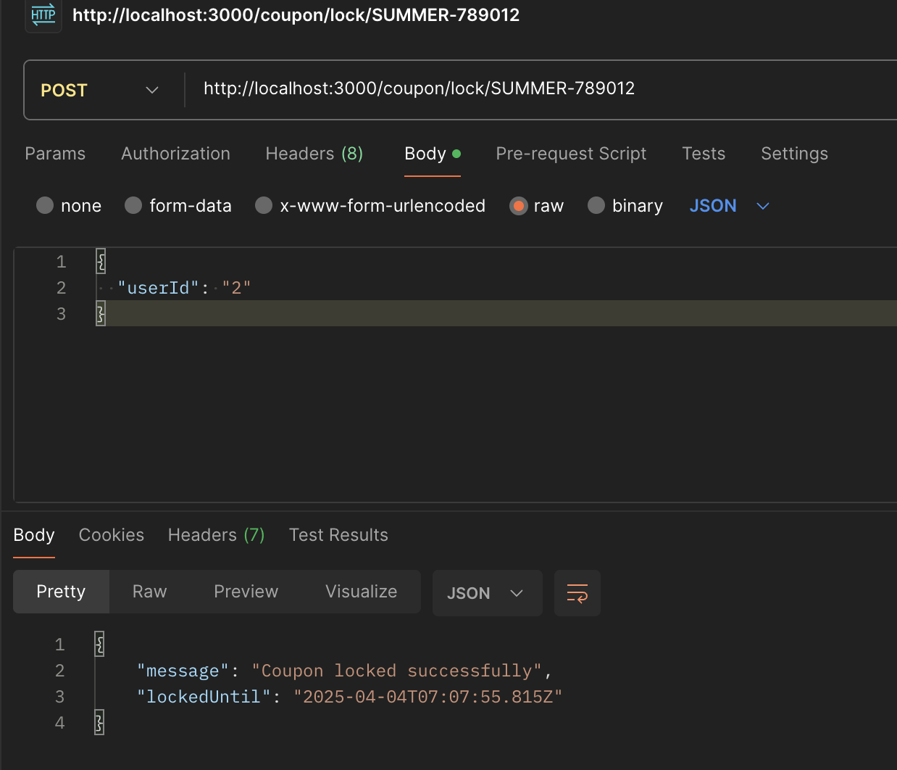
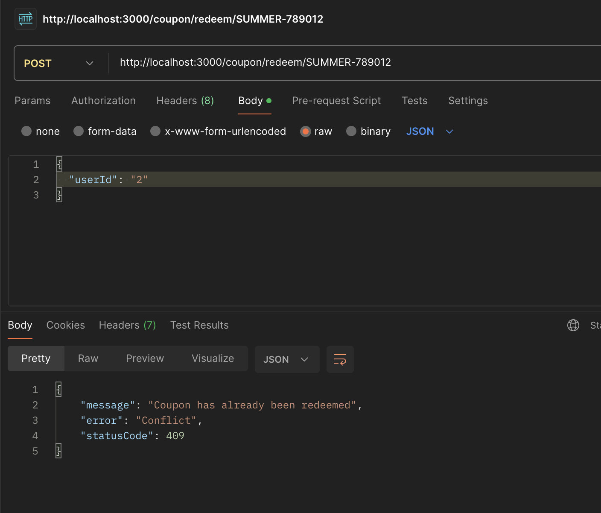


## Tech Stack

- **Backend Framework**: NestJS
- **Database**: PostgreSQL
- **Cache**: Redis
- **ORM**: TypeORM
- **API Documentation**: Swagger
- **Cloud Platform**: AWS

## Prerequisites

- Node.js (v18 or higher)
- PostgreSQL
- Redis

## Installation

1. Clone the repository:
```bash
git clone <https://github.com/soygustavogonzales/qurable>
cd coupon
```

2. Install dependencies:
```bash
npm install
```

3. Create a `.env` file in the root directory:
```env
DB_HOST=localhost
DB_PORT=5432
DB_USERNAME=postgres
DB_PASSWORD=postgres
DB_NAME=coupons
REDIS_HOST=localhost
REDIS_PORT=6379
```

4. Run database migrations:
```bash
npm run migration:run
```

5. Start the development server:
```bash
npm run start:dev
```

## API Documentation

Once the server is running, you can access the Swagger documentation at:
```
http://localhost:3000/api
```

## API Endpoints

### Coupon Book Management

- `POST /coupon` - Create a new coupon book
- `GET /coupon` - Get all coupon books
- `POST /coupon/codes/:id?` - Upload coupon codes to a book

### Coupon Operations

- `POST /coupon/assign` - Assign a random coupon to a user
- `POST /coupon/assign/:code` - Assign a specific coupon to a user
- `POST /coupon/lock/:code` - Lock a coupon for redemption
- `POST /coupon/redeem/:code` - Redeem a locked coupon

## Testing

Run the test suite:
```bash
npm test
```

Run e2e tests:
```bash
npm run test:e2e
```

## AWS Deployment

The system is designed to be deployed on AWS with the following services:
- ECS/EKS for container orchestration
- RDS for PostgreSQL database
- ElastiCache for Redis
- CloudFront for CDN
- Route 53 for DNS
- Application Load Balancer
- CloudWatch for monitoring
- X-Ray for tracing

## Project Structure

```
src/
├── coupon/
│   ├── controllers/
│   │   └── couponBook.controller.ts
│   ├── services/
│   │   ├── couponBook.service.ts
│   │   └── couponCode.service.ts
│   ├── entities/
│   │   ├── couponBook.entity.ts
│   │   ├── couponCode.entity.ts
│   │   └── user.entity.ts
│   └── dto/
│       ├── createCouponBook.dto.ts
│       ├── assignCoupon.dto.ts
│       └── uploadCouponCodes.dto.ts
├── app.module.ts
└── main.ts
```

## Contributing

1. Fork the repository
2. Create your feature branch (`git checkout -b feature/amazing-feature`)
3. Commit your changes (`git commit -m 'Add some amazing feature'`)
4. Push to the branch (`git push origin feature/amazing-feature`)
5. Open a Pull Request

## License

This project is licensed under the MIT License - see the [LICENSE](LICENSE) file for details.

## Support

For support, email support@example.com or open an issue in the repository.

## Acknowledgments

- NestJS team for the amazing framework
- TypeORM for the excellent ORM
- Redis for the powerful caching solution
- DBMS related to PostgreSQL

## Hashtags
#coupon-management #nestjs #postgresql #redis #typescript #api #backend #microservices #aws #docker #swagger #typeorm #rest-api #coupon-system #ecommerce #digital-coupons #promotional-codes #vouchers #discounts #loyalty-program

